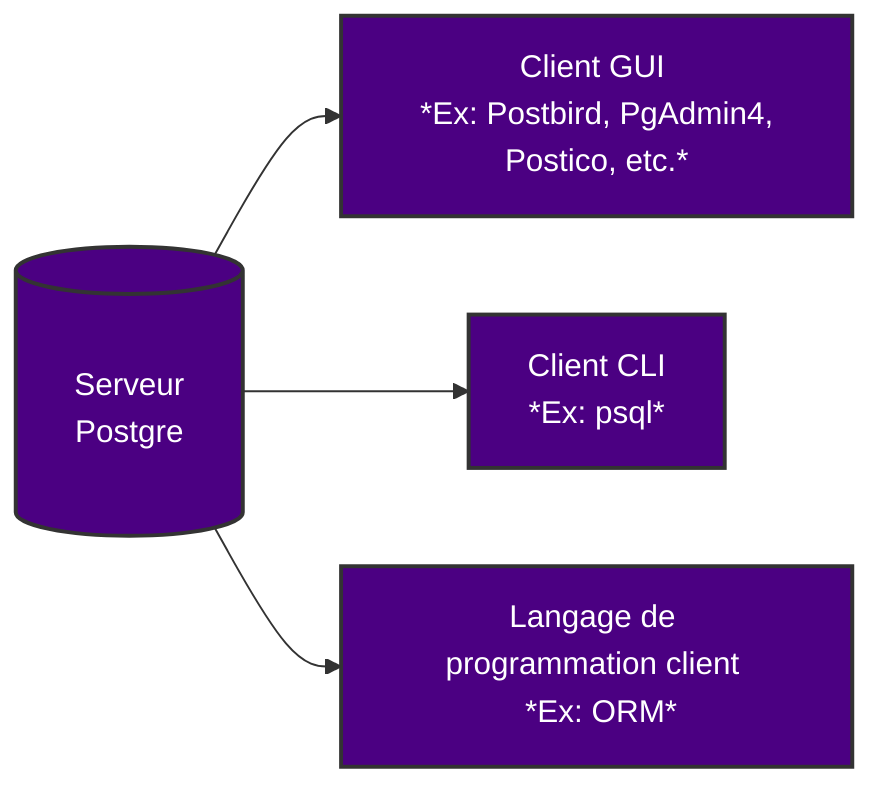

# Introduction POC PostgreSQL

## Dépréciation des services Mongo Atlas

Le service permettant la mise en ligne de fichiers avec Online Archive a été dépréciée en début de semaine. *(Voir la [🛑 Réunion dépréciation](https://github.com/users/theox33/projects/1/views/1?pane=issue&itemId=80737220) pour plus de détails)*

Le travail effectué dans le but de gérer un stockage de fichiers dynamique sur MongoDb Atlas doit donc être interrompu.

Il nous faut donc adopter une nouvelle architecture et y développer d'autres API.

## Objectif

Comme dit à l'issue de la réunion, le travail effectué avec MongoDb Atlas peut me servir de base pour créer une API qui permettra d'uploader des documents et garder leur métadonnées. Pour celà, ma Tech Lead m'a conseillé d'utiliser la BDD PostGreSQL qui permet une gestion de documents native.

L'idée est d'avoir une première esquisse de l'API qui recevra les documents depuis la solution vers PowerSync. Il faut donc qu'elle fonctionne avec des requêtes ajax, et non implémenter du front afin de permettre une scalabilité importante pour potentiellement directement l'implémenter dans le logiciel.

## PostgreSQL

Selon le site Web de PostgreSQL, Postgres est « un système de base de données relationnelle objet open-source puissant, avec plus de 30 ans de développement actif, qui lui a valu une solide réputation de fiabilité, de robustesse des fonctionnalités et de performance. »

Comme d'autres bases de données relationnelles, on peut modéliser presque toutes les données et leurs relations en utilisant des tables, des clés, des contraintes, des déclencheurs, et plus encore.

Postgres est actuellement utilisé en production par de nombreuses entreprises technologiques modernes, qu'il s'agisse de petites startups ou de grandes organisations telles qu'Apple, Instagram, Twitch et Reddit.

Postgres lui-même est un « serveur » de base de données. Il existe plusieurs façons de se connecter à Postgres via des « clients », y compris des interfaces graphiques (GUI), des interfaces en ligne de commande (CLI) et des langages de programmation souvent via des ORM.
Pour exécuter et utiliser Postgres sur mon propre ordinateur, il faut *configurer à la fois un **serveur Postgres** et un **client***.

Dans notre cas, le plus intéressant pour nous est qu'il est possible d'uploader des fichiers tels quel dans la base de donnée Postgre.



## Configuration du serveur Postgres

J'ai installé Postgres sur Windows ainsi que le logiciel Dbeaver qui permet d'avoir une interface graphique avec Postgres au lieu d'utiliser exclusivement les commandes dans un terminal.
À partir de DBeaver je peux commencer à écrire des requêtes SQL, sélectionner une base de données avec laquelle travailler, ajouter des tables et les manipuler.

Je ne vais pas détailler l'intallation de PostgreSQL car il s'agit d'un simple installeur avec des étapes à suivre.

## Création d'une nouvelle app NestJS

De la même manière que les fois précédentes, je créé une app NestJS en utilisant les commandes du terminal. `nest new upload-api`
Je créé donc le projet `upload-api` qui me permettra :
- Uploader des documents
- Générer un fichier de métadonnées
- Télécharger le document
- Obtenir les métadonnées

Une fois le projet créé, j'installe les dépendances nécessaires comme `multer` pour l'upload de documents et trois autres packages `@nestjs/typeorm`, `typeorm` et `pg`. Le package `@nestjs/typeorm` est utilisé pour obtenir les modules TypeOrm et d’autres modules importants pour travailler avec TypeOrm. J'ai également installé `pg`, qui aide à se connecter et à communiquer avec la base de données PostgreSQL.

### Connexion à la base de données

J'ajoute le module TypeORM dans le module de l'application pour établir la connexion avec PostGreSQL `/src/app.module.ts` comme ceci :

#### `app.module.ts`
``` typescript
import { Module } from '@nestjs/common';
import { TypeOrmModule } from '@nestjs/typeorm';
import { FileModule } from './file/file.module';
import { File } from './file/entities/file.entity';

@Module({
  imports: [
    TypeOrmModule.forRoot({
      type: 'postgres',
      host: 'localhost',
      port: 5432,
      username: 'postgres',
      password: 'postgres',
      database: 'upload-api',
      entities: [File],
      synchronize: true,
      logging: true,
    }),
    FileModule,
  ],
})
export class AppModule {}
```

> Ici, on comprend bien qu'il s'agit des propriétés de ma base de données créé localement précédamment avec PostGreSQL qui sont nécessaires pour établir la connexion avec l'API NestJS. La base de données s'appelle `upload-api` et j'ai mis un profil/mot de passe par défaut simple `postgres`, elle a un port d'écoute je j'ai réglé lors de l'installation à 5432.

> [!NOTE]
> J'ai décidé de créer une entitée nommée `File` pour définir et manipuler des `Files` *(= fichiers)* que je définirai plus tard.

#### Test de connexion

En lançant un simple `npm run start:dev`, je vois si la connexion s'effectue entre mon API et ma BDD.
Auncun message d'erreur ne s'est affiché et l'application fonctionne normalement. Je peux donc continuer.

### Création d'une entité

Maintenant, je peux créer une entité nommée “File” avec laquelle j'effectuerai les opérations CRUD pour la gestion de fichiers :

J'ai découvert qu'on pouvait également faire ça avec une commande dans le terminal : `nest g res file`.

Cela a créé le dossier `/src/file` avec dedans un contrôleur, module et service par défaut pour l'entité `file` ainsi qu'un dossier `/src/file/entities` avec le fichier définissant l'entité file :


#### `file.entity.ts`
``` typescript
import { Column, Entity, PrimaryGeneratedColumn } from 'typeorm';

@Entity()
export class File {
  @PrimaryGeneratedColumn()
  id: number;

  @Column({ type: 'varchar' })
  fileName: string;

  @Column({ type: 'varchar' })
  fileType: string;

  @Column({ type: 'int' })
  fileSize: number;

  // Colonne pour stocker les données binaires du fichier
  @Column({ type: 'bytea' })
  fileData: Buffer;
}
```

> J'ai ici défini les colonnes d'une entité `File`. Ainsi, chaque fichier dispose de son identifiant unique, son nom, son type, sa taille, et ses données binaires *(elles seront utilisées pour reconstituer le fichier)*.

### Définition du service et du contrôleur de l'entité

Je mets maintenant à jour le fichier de service des fichiers et effectue des opérations CRUD :

#### `file.service.ts`
``` typescript
import { Injectable } from '@nestjs/common';
import { InjectRepository } from '@nestjs/typeorm';
import { Repository } from 'typeorm';
import { File } from './entities/file.entity';

@Injectable()
export class FileService {
  constructor(
    @InjectRepository(File) private readonly fileRepository: Repository<File>,
  ) {}

  async uploadFile(file: Express.Multer.File): Promise<File> {
    const newFile = new File();
    newFile.fileName = file.originalname;
    newFile.fileType = file.mimetype;
    newFile.fileSize = file.size;
    newFile.fileData = file.buffer;

    return this.fileRepository.save(newFile);
  }

  async getFile(id: number): Promise<File> {
    return this.fileRepository.findOneBy({ id });
  }

  async getFileMetadata(id: number): Promise<File> {
    return this.fileRepository.findOne({
      where: { id },
      select: ['id', 'fileName', 'fileType', 'fileSize'],
    });
  }

  async deleteFile(id: number): Promise<void> {
    await this.fileRepository.delete({ id });
  }
}
```

> Dans `file.service.ts`, le service gère la logique métier de manipulation des fichiers. La méthode `uploadFile` prend un fichier en entrée, extrait ses informations *(nom, type, taille)* et le contenu binaire pour créer un nouvel enregistrement dans la base de données. Ensuite, ce fichier est sauvegardé à l'aide de `TypeORM`, ce qui permet de l'ajouter facilement à la base de données `PostgreSQL`. Le service propose également des méthodes pour récupérer un fichier complet (méthode `getFile`) ou seulement ses métadonnées (méthode `getFileMetadata`) ou encore le supprimer (méthode `deleteFile`), offrant ainsi un accès flexible aux informations stockées.

#### `file.controller.ts`
``` typescript
import { Controller, Post, UploadedFile, UseInterceptors, Get, Param, Res, NotFoundException } from '@nestjs/common';
import { FileInterceptor } from '@nestjs/platform-express';
import { FileService } from './file.service';
import { Response } from 'express';

@Controller('file')
export class FileController {
  constructor(private readonly fileService: FileService) {}

  @Post('upload')
  @UseInterceptors(FileInterceptor('file'))
  async uploadFile(@UploadedFile() file: Express.Multer.File) {
    return this.fileService.uploadFile(file);
  }

  // Route pour télécharger le fichier
  @Get('download/:id')
  async downloadFile(@Param('id') id: number, @Res() res: Response) {
    const file = await this.fileService.getFile(id);
    if (!file) {
      throw new NotFoundException('Fichier non trouvé');
    }

    // Configurer les en-têtes pour le téléchargement
    res.set({
      'Content-Type': file.fileType,
      'Content-Disposition': `attachment; filename="${file.fileName}"`,
    });

    // Envoyer les données binaires du fichier
    res.send(file.fileData);
  }

  // Route pour obtenir les métadonnées d'un fichier
  @Get('metadata/:id')
  async getFileMetadata(@Param('id') id: number) {
    const file = await this.fileService.getFileMetadata(id);
    if (!file) {
      throw new NotFoundException('Fichier non trouvé');
    }

    // Retourner uniquement les métadonnées, sans les données binaires
    return {
      id: file.id,
      fileName: file.fileName,
      fileType: file.fileType,
      fileSize: file.fileSize,
    };
  }
}
```

> Le fichier `file.controller.ts` quant à lui, définit les routes de l'API pour interagir avec les fichiers. La route `POST /file/upload` permet de télécharger un fichier vers le serveur, en utilisant l'intercepteur `Multer` pour traiter le fichier avant de l'envoyer au service pour stockage. Ensuite, la route `GET /file/download/:id` est utilisée pour récupérer et télécharger un fichier spécifique, identifié par son ID. Si le fichier est trouvé, il est renvoyé avec les en-têtes appropriés pour le téléchargement. La route `GET /file/metadata/:id` permet d’obtenir uniquement les métadonnées d’un fichier, sans transmettre son contenu binaire, ce qui est utile pour afficher des informations sur le fichier sans en récupérer l’intégralité. Enfin, la route `GET /file/delete/:id` vérifie l'existance d'un fichier, puis renvoie les informations du fichier supprimé.

## Test de l'API

Maintenant, je teste l'implémentation de mes routes avec Postman :

### Upload d'un document

#### Postman


#### Console de l'application NestJS


> On voit que le fichier a bien été inséré dans la BDD puis que l'application renvoie les métadonnées ainsi que le buffer du fichier uploadé.

#### Base de données locale Postgres


### Récupération des métadonnées d'un document

L'ID du document envoyé est `4`. Je vais donc tenter d'obtenir ses métadonnées :

#### Postman


#### Console de l'application NestJS


### Téléchargement d'un document

#### Console de l'application NestJS


#### Postman


> [!NOTE]
> Il est également possible de faire ça pour des fichiers autres que .txt, voici par exemple un .pdf ou .png :
>
> #### Upload
> 
> 
>
> ### Téléchargement
> 
> 

### Suppression d'un document

#### Postman


#### Base de données


#### Console de l'application NestJS


